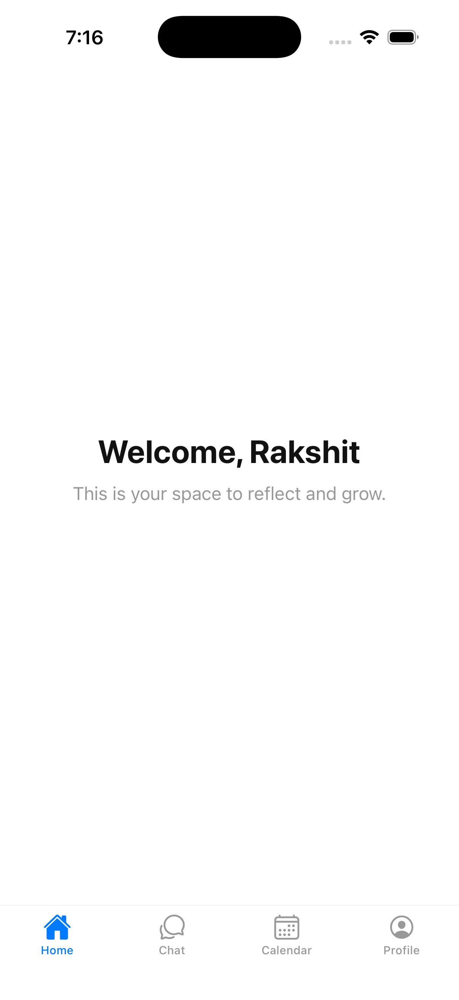
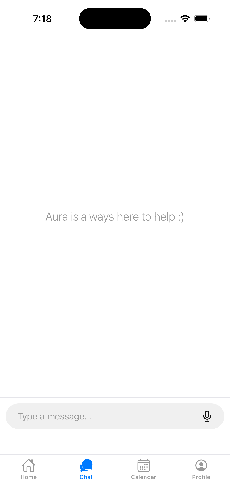
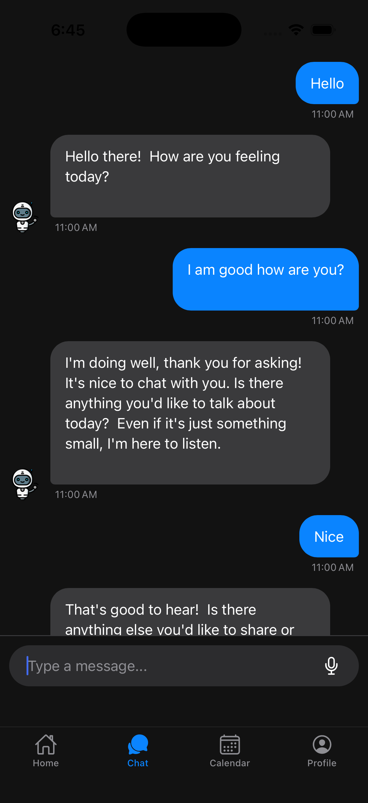
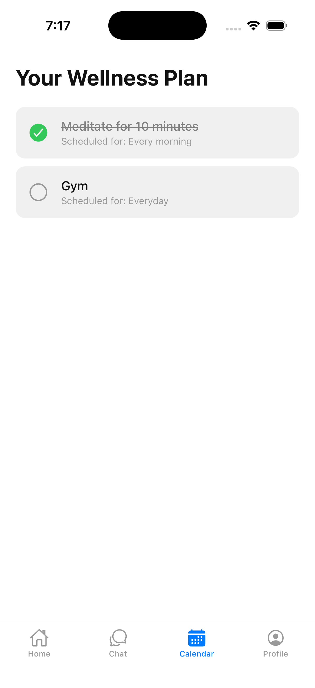
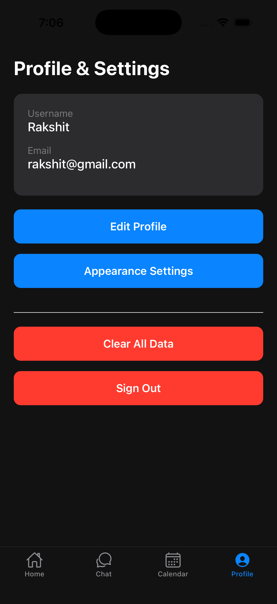

# AuraStream

A supportive and empathetic AI wellness companion designed to provide a safe, non-judgmental space for users to express their thoughts and feelings.

## About The Project

AuraStream is a cross-platform mobile application built with React Native and Expo. It leverages the power of Google's Gemini API to create a conversational AI, "Aura," that is specifically engineered for mental wellness support. The app provides users with a private, secure, and accessible tool for self-reflection, while also offering features to help them build positive habits through a personalized wellness plan.

## Roadmap

AuraStream is currently in active development, and future updates are planned to enhance functionality and user experience. Planned enhancements include:

- Doctor Consultation: Implementing a feature where the AI can suggest a consultation with a licensed professional and facilitate booking.  
- Advanced Calendar Features: Adding reminders and notifications for scheduled activities.  
- Text-to-Speech: Giving Aura the ability to speak its responses back to the user.  
- Data Visualization: Providing users with insights and visualizations based on their mood and activity history.  

This project will continue to evolve with additional features and improvements in future releases.

## Key Features

- **Empathetic AI Chatbot**: Have real-time conversations with Aura, an AI companion with a carefully engineered persona for supportive dialogue.  
- **Persistent Chat History**: All conversations are securely stored per-user in the cloud using Firebase Firestore, with real-time syncing.  
- **User Authentication**: Secure sign-up and login functionality using Firebase Authentication, including username and profile management.  
- **AI-Powered Wellness Plan**: Aura can intelligently suggest wellness activities like meditation or exercises and automatically add them to your in-app calendar.  
- **Manual Wellness Planning**: Users have full control to manually add, complete, and delete activities from their wellness plan.  
- **Dynamic Theming**: A user-configurable appearance system with "Auto," "Light," and "Dark" modes that persists across sessions.  
- **Voice-to-Text Input**: Integrated speech recognition for hands-free interaction with the AI.  

## Screenshots
<p align="center">
  
  
  
  
  
</p>

## Built With

- **Frontend**: React Native with Expo  
- **Language**: JavaScript (ES6+)  
- **Navigation**: React Navigation (Stack & Tab Navigators)  
- **Backend & Database**: Google Firebase (Authentication & Cloud Firestore)  
- **Artificial Intelligence**: Google Gemini API (gemini-1.5-flash-latest)  
- **UI & Styling**: React Native StyleSheet, @expo/vector-icons  
- **Local Storage**: AsyncStorage  

## Getting Started

### Prerequisites

- Node.js and npm/yarn installed.  
- Expo CLI installed (`npm install -g expo-cli`).  
- An Android or iOS emulator/simulator, or a physical device with the Expo Go app.  

### Installation

```bash
git clone https://github.com/your-username/AuraStream.git
cd AuraStream
yarn install
```
Create a `.env` file in the root of the project and add your Firebase and Gemini API keys:

```
EXPO_PUBLIC_FIREBASE_API_KEY="YOUR_KEY"
# ...add other Firebase keys
EXPO_PUBLIC_GEMINI_API_KEY="YOUR_KEY"
```

Run the app:

```bash
npx expo start
```

## Roadmap

- Doctor Consultation: Implementing a feature where the AI can suggest a consultation with a licensed professional and facilitate booking.  
- Advanced Calendar Features: Adding reminders and notifications for scheduled activities.  
- Text-to-Speech: Giving Aura the ability to speak its responses back to the user.  
- Data Visualization: Providing users with insights and visualizations based on their mood and activity history.  

## License

Distributed under the MIT License. See LICENSE for more information.

## Author
Rakshit Kumar
